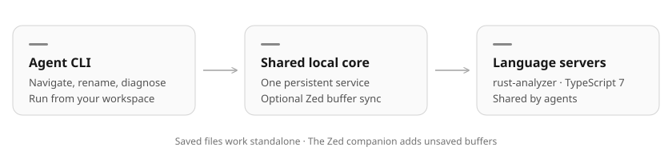

# Editor LSP Bridge

[](https://www.rust-lang.org/) [](https://tokio.rs/) [](https://microsoft.github.io/language-server-protocol/) [](https://github.com/pumuckelo/mcp-editor-lsp-bridge/releases)

Rust and TypeScript language intelligence for coding agents. Run one local core, then use the `bridge` CLI for navigation, diagnostics and cross-file refactoring. Agents share a language server per workspace.

Supports **rust-analyzer** and **TypeScript through vtsls or typescript-language-server**, plus the **native TypeScript 7 LSP**, including JavaScript. An optional Zed companion adds unsaved editor buffers.



## Install

For macOS and Linux, on ARM64 or x64:

```sh
curl -fsSL https://github.com/pumuckelo/mcp-editor-lsp-bridge/releases/latest/download/install.sh | sh
```

Add `~/.local/bin` to your PATH. Run the same command to upgrade, then restart the core.

Your projects also need their language server:

- **Rust:** install your Rust toolchain and `rustup component add rust-analyzer`.
- **TypeScript / JavaScript:** install the project's existing dependencies. For TypeScript 4–6, install `@vtsls/language-server` locally or globally (requires Node). TypeScript 7 uses its native LSP automatically. The bridge uses the project's TypeScript version; no upgrade is required.

## Quick start

Keep the core running in a terminal:

```sh
bridge serve
```

Then, from your project in another terminal:

```sh
bridge workspace-connect
bridge workspace-status
bridge diagnostics --check
```

Open [localhost:47831](http://127.0.0.1:47831/) to see analyzer and companion status or manage workspaces. Each CLI command connects to this core and exits.

### Use with an agent

Give your agent the [setup instructions](skills/editor-lsp-bridge/references/setup.md) and ask it to install and use the bridge in your repository. They cover installing the [bridge skill](skills/editor-lsp-bridge/SKILL.md) and adding project instructions for future work.

## Navigation and refactoring

```sh
bridge workspace-symbols --query MyType
bridge document-symbols --path src/lib.rs
bridge definition --path src/lib.rs --symbol my_function
bridge references --path src/lib.rs --symbol my_function
bridge hover --path src/lib.rs --symbol my_function
bridge rename --path src/lib.rs --symbol old_name --new-name new_name
```

Use `.ts`, `.tsx` or `.js` paths for TypeScript and JavaScript. Paths are relative to your current directory. The CLI infers the workspace; use `--workspace /path/to/root` to select one explicitly.

**Rename applies immediately**, including references across files. To inspect a rename first:

```sh
bridge rename --path src/lib.rs --symbol old_name --new-name new_name --preview
bridge apply-rename --plan-id RETURNED_ID
```

Code actions can also be inspected and applied:

```sh
bridge code-actions --path src/lib.rs --line 12 --character 8
bridge apply-code-action --action-id RETURNED_ID
```

Positions use zero-based lines and UTF-16 characters. Preview plans and code actions expire after five minutes. If files change before application, request a fresh plan. Text edits are supported; file creation, deletion and moves are not.

### JSON and command discovery

```sh
bridge hover --json '{"path":"src/lib.rs","symbol":"my_function"}'
bridge tools
bridge rename --help
bridge schema code-actions
```

Complex input also accepts `--stdin`. JSON paths are workspace-relative. Commands return compact JSON; use `--verbose` for more detail. Inspect the result before assuming an edit applied: ambiguous symbols can return candidates instead.

## Diagnostics and workspaces

`bridge diagnostics` reads cached language-server diagnostics, including unsaved buffers when a companion is connected. `bridge diagnostics --check` waits for a saved-file compiler check. Inspect readiness and freshness as well as the error list.

Rust checks use `cargo check --workspace --all-targets`. TypeScript checks use the workspace root's `tsconfig.json` or `jsconfig.json`; their scope follows that configuration.

```sh
bridge workspace-status --all
bridge workspace-disconnect
bridge workspace-connect
```

**Disconnect** in the dashboard or CLI stops that workspace's analyzers, watcher and checks. Use **Reconnect** or `workspace-connect` to resume. Closing Zed leaves the standalone analyzer running; stop unused workspaces or stop the core with Ctrl-C. Separate Git worktree directories use separate analyzers.

## Optional: unsaved buffers from Zed

Standalone operation reads saved files. To include unsaved buffers:

1. Install the executables above.
2. Install Rust via rustup for this optional development-extension build. In Zed, run **zed: install dev extension** and select `~/.local/share/editor-bridge/current/zed-extension` when using the release installer (adjust for `INSTALL_ROOT`). No repository clone is needed. Let Zed build the extension in its required WebAssembly format; do not overwrite `extension.wasm` with a raw Cargo build artifact.
3. Add the companion alongside your existing servers in Zed settings:

```json
{
  "languages": {
    "Rust": { "language_servers": ["...", "editor-lsp-bridge"] },
    "TypeScript": { "language_servers": ["...", "editor-lsp-bridge"] },
    "TSX": { "language_servers": ["...", "editor-lsp-bridge"] },
    "JavaScript": { "language_servers": ["...", "editor-lsp-bridge"] }
  }
}
```

If Zed cannot find the executable on its PATH, add an absolute binary path, replacing the example with your installed executable path:

```json
{
  "lsp": {
    "editor-lsp-bridge": {
      "binary": {
        "path": "/home/you/.local/bin/mcp-editor-lsp-bridge",
        "arguments": ["companion", "--endpoint", "http://127.0.0.1:47831"]
      }
    }
  }
}
```

Open the actual workspace root in Zed and restart language servers after changing settings. Reload/reinstall the dev extension after updating its manifest. Run `bridge workspace-status` and verify `companionConnected: true`; analyzer readiness alone does not verify the companion. The dashboard shows **Zed companion connected** when registered. To verify unsaved-buffer forwarding, edit a supported file without saving and inspect `bridge workspace-status --verbose` for that document with `source: "zed"`, then run `bridge diagnostics`.

Zed retains its own analyzer. The companion only forwards open/change/save/close events and snapshots; it does not analyze or index code. The bridge runs its dedicated analyzer, so there are two analyzers, not a proxy or a third analyzer.

Agent disk edits take precedence over stale companion overlays in the bridge. This does not overwrite Zed's unsaved buffer or force a save: discard conflicting old editor changes as usual. A later explicit save is a new disk write. Heartbeats detect an unclean companion disconnect and restore saved-file state.

## Choose a TypeScript backend

In a workspace's dashboard card, choose **TypeScript backend** beside the analyzer name and click **Apply**. You can also switch from the CLI:

```sh
bridge workspace-backend --backend vtsls
bridge workspace-backend --backend typescript-language-server
bridge workspace-backend --backend auto
```

Install `typescript-language-server` locally or globally to try the alternative. Both wrappers use the workspace's TypeScript SDK. **Auto** selects native LSP for TS7 and vtsls for TS4–6; **Native** requires TS7.

Switching restarts the selected workspace and preserves editor buffers. If startup fails, the previous workspace stays running. Selection survives disconnect/reconnect until the core restarts. For a persistent default, pass a config file to `bridge serve --config bridge.json`:

```json
{ "typescript_backend": "vtsls" }
```

## Configuration and troubleshooting

Use `bridge serve --port PORT --config bridge.json` to customize startup, and `--endpoint http://127.0.0.1:PORT` on CLI commands for a different port.

The configuration accepts `analyzer` (rust-analyzer path), `typescript_analyzer` (native TypeScript executable), `analyzer_settings`, `typescript_settings`, `vtsls_analyzer`, `vtsls_settings`, `typescript_language_server`, `typescript_language_server_settings`, `cargo_features`, `all_features`, `no_default_features`, `cargo_target` and `environment`. Restart the core after changing the config file; Zed settings are separate. `vtsls_settings` uses nested `typescript`, `javascript` and `vtsls` settings. `typescript_language_server_settings` contains that server’s initialization options. SDK paths are pinned to the workspace; saved-file checks always prefer its compiler.

- **Connection refused:** start `bridge serve` at the expected endpoint.
- **Operation not permitted:** the agent sandbox may block localhost. Use its permission flow to retry; starting another core will not help.
- **Companion disconnected:** analyzer readiness is separate. Follow the Zed setup above and open a supported file.
- **Lost response during an edit:** inspect the files before retrying; the edit may already have applied.
- **Stale analysis:** reconnect after changes to external dependencies or build-script inputs. Restart the core after an analyzer crash.

## Optional MCP

Connect a Streamable HTTP MCP client to `http://127.0.0.1:47831/mcp`. It uses the same running core and operations as the CLI; tool schemas are available through the client.

## Contributing / Development

With a current Rust toolchain, from this repository:

```sh
cargo install --path . --locked
cargo fmt --check
cargo clippy --all-targets -- -D warnings
cargo test
```

Real-server tests also require rust-analyzer and native TypeScript 7:

```sh
BRIDGE_TYPESCRIPT=/absolute/path/to/typescript7/tsc cargo test --all-targets -- --include-ignored
```

For companion development, select this checkout's `zed-extension` directory through Zed's **install dev extension** command and let Zed build it. `examples/demo` provides a Rust fixture. See [validation notes](docs/VALIDATION.md) and the [companion protocol](docs/companion-protocol.md).

`src/application.rs` owns shared operations; CLI and MCP use adapters over that service. `Core` owns workspace state and processes, and `src/language.rs` holds server-specific policy. The dashboard is embedded HTML/CSS/JavaScript with no frontend build step.

### Releases

From a clean, committed checkout on a branch:

```sh
cargo release
```

The helper creates and pushes a version tag with the branch, bumping and committing the patch version if the current version was already released from another commit. Set major, minor or prerelease versions manually. GitHub Actions builds and publishes platform archives, skills, companion sources and the installer.

Installer sources are in `scripts/installer/`. Bundle them with `sh scripts/bundle-installer.sh > install.sh`; edit source modules rather than generated bundles.
